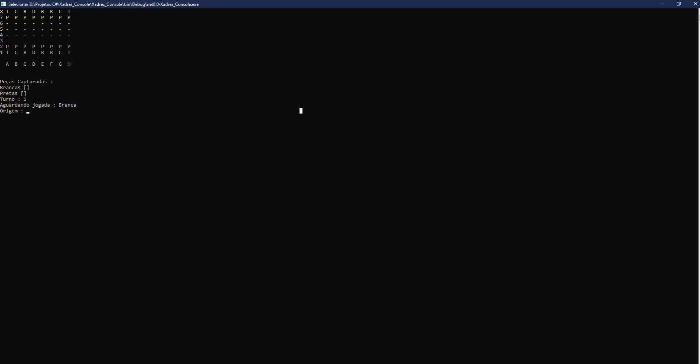

♟️ Jogo de Xadrez no Console - C#

Um jogo de xadrez desenvolvido em C#, totalmente executado no console, com foco na fidelidade às regras oficiais do jogo. Ideal para quem curte lógica, estratégia e programação orientada a objetos!

🕹️ Funcionalidades
✅ Interface no console com visualização do tabuleiro em tempo real

✅ Regras oficiais do xadrez implementadas

✅ Movimento válido para todas as peças (rei, dama, torre, bispo, cavalo e peão)

✅ Detecção de xeque e xeque-mate

✅ Sistema de captura e rastreio das peças eliminadas

✅ Controle de turnos e cores das peças

✅ Validação de jogadas ilegais

🛠️ Tecnologias Utilizadas
💻 C#

🧱 .NET 6.0

🧠 Programação Orientada a Objetos (POO)

🎮 Lógica de jogo baseada em console

📷 Imagens do Projeto

  

 
  

